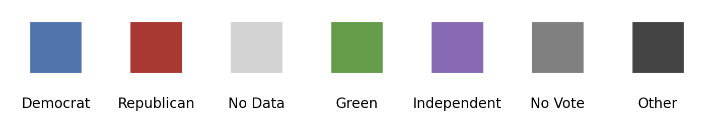

# Customization

PoliSciPy allows you to customize various aspects of your electoral college maps, from the colormap to map labels and titles. Customizing your map can help make your visualizations more informative and visually appealing.

---

## Colormaps

Colormaps are an important part of creating the electoral college maps.

### Default Colormap

PoliSciPy has a default color map that looks like this:

```python
default_party_colors = {
    'Democrat': '#4875b1',    
    'Republican': '#b82b2b',  
    'No Data': 'lightgray',
    'Green': '#519e3e',
    'Independent': '#8d69b8',
    'No Vote': 'gray'
}
```

In addition, any defecting voter who does not belong to a specific political party is represented by the color `#444444` (dark gray) by default.

Below is a visualization of the full default colormap:

<div align="center">
    
    <div style="text-align: center;"><em>Default Colormap in PoliSciPy</em></div>
</div>

### Creating custom colormaps

Users can create custom colormaps to better suit their specific needs. To define a custom colormap, simply create a dictionary similar to the `default_party_colors` example above, specifying the desired color for each party or candidate.

Here is an example of a custom colormap:

```python
custom_party_colors = {
    'Democrat': '#1f77b4',  # Blue for Democrats
    'Republican': '#ff7f0e',  # Orange for Republicans
    'Independent': '#2ca02c',  # Green for Independents
    'No Data': 'grey',  # Grey for missing data
    'Green': '#9467bd',  # Purple for Green Party
    'Sam Smith', 'cyan' # Add another party/candidate
}
```

To apply your custom colormap in PoliSciPy, pass it as a parameter to the relevant plotting function, such as `plot_electoral_map()`:

```python
plot_electoral_map(gdf, colormap=custom_party_colors)
```

This flexibility allows you to tailor the visual representation of maps to match your project's requirements or preferences.

{: .warning }
> When working with colormaps you might encounter the error:  
>
> `The following party(ies) found in data, but not defined in colormap: Party1, Party2`
>
> While PoliSciPy does not impose a limit on how many different party colors you can define, **you must have at least one color defined for every party** that you plan on visualizing in your electoral college map. If you have a winning political party defined in your data that does not have a corresponding color in your colormap, you will encounter this error.

---

## Map Customization

PoliSciPy also offers several ways to customize other aspects of your electoral college maps, including map titles, labels, and legends. Here are a few options for customizing the appearance of your map.

### Titles and Labels

You can customize the title of your map and the labels for the states or regions. For example:

```python
# Plot electoral college map with a custom title and labels
ps.plot_electoral_map(
    data=your_data,
    colormap=custom_party_colors,
    title="2024 U.S. Electoral College Map",
    labels={"Democrat": "Democratic", "Republican": "GOP", ...}
)
```

### Adding Legends

Legends help users understand what different colors represent. PoliSciPy will automatically generate a legend based on the colormap you use, but you can also customize the appearance of the legend, such as its position, size, and labels.

Example:

```python
ps.plot_electoral_map(
    data=your_data,
    colormap=custom_party_colors,
    legend_title="Political Party",
    legend_position="bottom"
)
```

### Customizing State Borders

You can adjust the borders between states, such as changing their width or color:

```python
ps.plot_electoral_map(
    data=your_data,
    colormap=custom_party_colors,
    border_color="#000000",
    border_width=1
)
```

### Other Styling Options

In addition to the features above, PoliSciPy allows other styling options such as:

- Adjusting opacity/transparency of regions.
- Changing the background color of the map.
- Adding or customizing annotations or markers.

Refer to the API Documentation for a full list of customization options.


