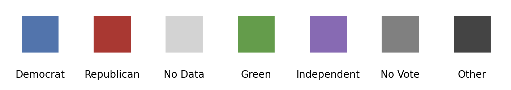

# Working with Data and Shapefiles

This section covers how to use shapefiles and related data with PoliSciPy to create custom maps for visualizing historical and current elections. You will learn how to load, manipulate, and merge shapefiles with election data to generate meaningful visualizations.

---

## Working with Shapefiles in PoliSciPy

Shapefiles are the foundation of electoral college map visualizations in PoliSciPy. They contain the geographic and boundary information necessary to render the polygons representing states, territories, and other regions of the map. This section explains the structure of shapefiles, how to load and process them, and how to integrate election data for subsequent visualization. *First it might be helpful to understand:*

### What is a Shapefile?

A shapefile is a widely used geospatial vector data format for geographic information system (GIS) software. It represents geographic features (e.g., states, counties) and their attributes. A shapefile typically consists of several files with the same name but different extensions, including:

- `.shp`: Contains geometry data (shapes of features).

- `.shx`: An index file to improve access to geometry data.

- `.dbf`: A database file storing attribute data for each feature (e.g., state names, FIPS codes).

**Note on Shapefiles:**

PoliSciPy uses modified shapefiles originally provided by the United States Census Bureau through the TIGER/Line dataset. For more information about the original shapefiles and how to access them, please visit the citation page.


### Inspecting the Shapefile

You can inspect the shapefile once you've loaded in it using the `load_shapefile()` method. If you type the following:

You can then inspect the shapefile shown below. A full list of all of the columns inlcuded in the shapefile can be seen in the Shapefiles section of the API documentation.

| STATEFP | NAME          | STUSPS | elec_votes_2024 | defectors  | defector_party | centroid_x | centroid_y | geometry       |
|---------|---------------|--------|-----------------|------------|----------------|------------|------------|----------------|
| 28      | Mississippi   | MS     | 6               | 0          | None           | -89.6652   | 32.7509    | MULTIPOLYGON   |
| 37      | North Carolina| NC     | 16              | 0          | None           | -79.3724   | 35.5415    | MULTIPOLYGON   |

## Merging Election Data

Plotting electoral college data using PoliSciPy is very easy. All you need to do is create a dictionary with the data that you woudl like to plot, and then merge it into the geoDataFrame above.

### Adding the data

In order to add the data.

Simply create or import a dictionary with the data that you would like to plot:

```python
winning_party_2024 = {
    'AL': 'Trump', 'AK': 'Trump', 'AZ': 'Trump', 'AR': 'Trump', 'CA': 'Harris', 'CO': 'Harris',
    'CT': 'Harris', 'DE': 'Harris', 'FL': 'Trump', 'GA': 'Trump', 'HI': 'Harris',
    'ID': 'Trump', 'IL': 'Harris', 'IN': 'Trump', 'IA': 'Trump', 'KS': 'Trump',
    'KY': 'Trump', 'LA': 'Trump', 'ME': 'Harris', 'MD': 'Harris', 'MA': 'Harris',
    'MI': 'Trump', 'MN': 'Harris', 'MS': 'Trump', 'MO': 'Trump', 'MT': 'Trump', 'NE': 'Trump',
    'NV': 'Trump', 'NH': 'Harris', 'NJ': 'Harris', 'NM': 'Harris', 'NY': 'Harris', 'NC': 'Trump',
    'ND': 'Trump', 'OH': 'Trump', 'OK': 'Trump', 'OR': 'Harris', 'PA': 'Trump', 'RI': 'Harris',
    'SC': 'Trump', 'SD': 'Trump', 'TN': 'Trump', 'TX': 'Trump', 'UT': 'Trump', 'VT': 'Harris',
    'VA': 'Harris', 'WA': 'Harris', 'WV': 'Trump', 'WI': 'Trump', 'WY': 'Trump', 'DC': 'Harris'
}
```

and then merge it with the `gdf` like below:

```python
# add the winning party and fill any missing data with 'No Data'
gdf['winning_party'] = gdf['STUSPS'].map(winning_party_2024).fillna('No Data')
```

This should merge the data so that you can start plotting it.

---

## Adding defectors

The ability to account for defecting or faithless electors is a crucial feature for electoral college maps. 

### Non-winner-takes-all states (Nebraska and Maine)

While most states use a "winner-takes-all" system, there are two notable exceptions: Nebraska and Maine. These states allocate their electoral votes differently, apportioning them based on the percentage of votes each candidate receives in each congressional district, in addition to awarding two electors based on the winner of the overall state-wide popular vote. This system can result in cases where, despite having five electoral votes, multiple candidates may be awarded electoral votes in Nebraska, leading to a "split" state.

If you would like to represent this "split" state for Nebraska and Maine, you can use the `defectors` and `defector_party` columns in the `geoDataFrame`. To do this, simply input the number of defectors for each state and their respective party affiliation.

```python
# set the number of defectors for each state to one
gdf['defectors'][10] = 1 # nebraska
gdf['defectors'][38] = 1 # maine

# set the party affiliation of the defecting voter
gdf['defector_party'][10] = 'Harris'
gdf['defector_party'][38] = 'Trump'
```

Note: To identify the correct index for each state in the `geoDataFrame`, you can filter it by the `STUSPS` column using the following line: `gdf['STUSPS']`

This will return a list of state abbreviations you can use:

```python
0     MS
1     NC
2     OK
3     VA
...
```

For a full example of creating Electoral College maps with non-winner-takes-all states included in the map see Example 1 in the Tutorials and Examples section.

### Faithless electors

Similarly, in United States elections, while rare, there is the ability for there to be what are called "faithless elecrots". Due to the nature and structure of the elecrtoal college, electoral college voters are not actuall required to vote for the candidate that thier state's electors vote for. In these cases, a candidate may win a particular state while an individual elector chooses to vote for another candidate. The most recent exampel fo this was in the 2016 election when 7 different electors cast vote againt the will of thier state.

### Split states

Another case when it could be usefuly to be able to plot defecting voters is when plotting historical elections. Many historical elections, especially those between 1700-1800 often invovled cases where states frequently split electoral votes leading to cases where many candidates won a portion of the total number of electoral votes from that state. Similar to how Nebraska and Maine operate today, it can be useful to plot these defecting electoral votes as an alternative way to represent multople canddiatew winning parts of a single state.

### Absent/missing electors

The last case where it might be useful to be able to plot defecting voters is where an electoral voter may be unable to cast thier vote entirely even if they had intended to vote for the cnadidate who had won the state. One example of this was during the 1864 election (the third example shown on the Examples page) where despite having 3 electoral votes, Nevada only cast 2 votes for Presdient Lincoln. This was a result of the fact that the third electoral voter was snowbound, and there was not yet a practice put in place to deal with absent voters. Not spceifying a poltical party for these defecting voters places them in a default, dark grey colored box to signify and represent an 'Other' catagory.

Note: any defector that does not have a value provided in the `defector_party` column will default to the `Other/Unspecified` catagory.

---

## Representing Territories

Some elections include territories or regions that, while part of the United States at the time, did not cast electoral votes. Representing these territories on the map can provide historical accuracy and help visualize the broader political or geographic context of an election.

## Handling Reconstruction

During the reconstruction period there were some Southern states that were part of the United States, but did not have any electoral college votes. These states are often shown with zero electoral college votes. To represent this on a map using PoliSciPy, you can create a separate category in the colormap to represent these states. Despite haveing no electoral votes, you can still include this additional category in the `winning_party` column when merging in the data. This will plot the color over the respective state without counting any of thier votes in the final results.

## Handling merged States

---

## Colormaps

Colormaps are an important part of creating the elecroal college maps

### Default Colormap

PoliSciPy has a default color map that looks like this:

```python
default_party_colors = {
    'Democrat': '#4875b1',    
    'Republican': '#b82b2b',  
    'No Data': 'lightgray',
    'Green': '#519e3e',
    'Independent': '#8d69b8',
    'No Vote': 'gray'
}
```

In addition, any defecting voter who does not belong to a specific party is represented by the color #444444 (dark gray) by default.

Below is a visualization of the full default colormap:

<div align="center">
    
    <div style="text-align: center;"><em>Default Colormap in PoliSciPy</em></div>
</div>

### Creating custom colormaps

Users can create custom colormaps to better suit their specific needs. To define a custom colormap, simply create a dictionary similar to the `default_party_colors` example above, specifying the desired color for each party or candidate.

Here is an example of a custom colormap:

```python
custom_colors = {
    'Democrat': '#1f77b4',  # Blue for Democrats
    'Republican': '#ff7f0e',  # Orange for Republicans
    'Independent': '#2ca02c',  # Green for Independents
    'No Data': 'grey',  # Grey for missing data
    'Green': '#9467bd',  # Purple for Green Party
    'Sam Smith', 'cyan' # Add another party
}
```

To apply your custom colormap in PoliSciPy, pass it as a parameter to the relevant plotting function, such as `plot_electoral_map()`:

```python
plot_electoral_map(gdf, colormap=custom_party_colors)
```

This flexibility allows you to tailor the visual representation of maps to match your project's requirements or preferences.

{: .warning }
> You might encounter the error:  
> "The following party(ies) found in data, but not defined in colormap: Party1, Party2"
> 
> While PoliSciPy does not impose a limit on how many different party colors you can define, **you must have at least one color defined for every party** that you plan on visualizing in your electoral college map. If you have a winning political party defined in your data that does not have a corresponding color in your colormap, you will encounter an error.
> 
> Make sure that the parties in your dataset are properly mapped to colors in your colormap to avoid any issues during visualization.