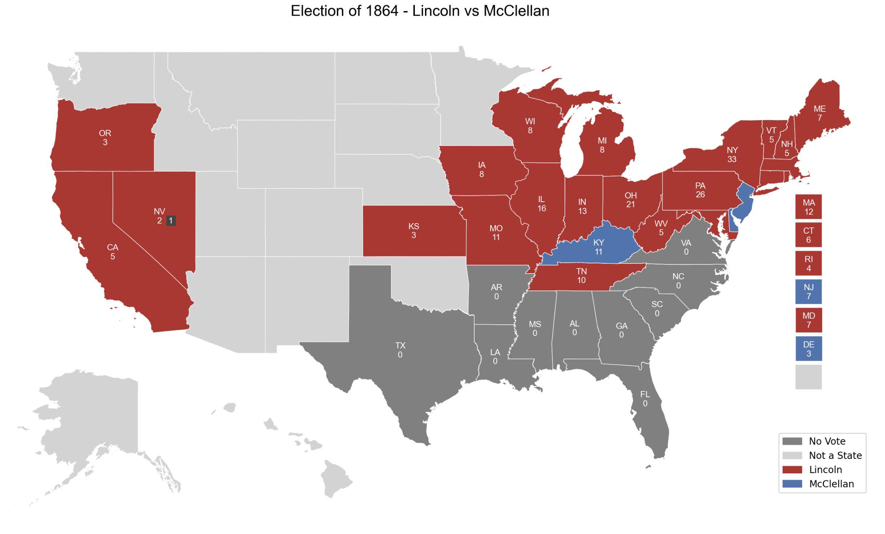

# Plotting Civil War and Reconstruction Electoral College Maps with PoliSciPy

During the Civil War and post-Reconstruction era, the political landscape of the United States underwent significant shifts. Several Southern states were excluded from participating in presidential elections entirly, particularly in the elections of 1864, 1868, and 1872. Using PoliSciPy, we can visualize these historical electoral maps, capturing the impact of Sessesion and Reconstruction policies on the Electoral College.

---

## Understanding Post-Reconstruction Elections

Following the Civil War, the Reconstruction period (1865–1877) saw federal efforts to reintegrate the Southern states into the Union. However, during the presidential elections of 1868 and 1872, some former Confederate states did not participate fully in the Electoral College.

Key aspects of post-Reconstruction elections:

- 1868 Election: Texas, Virginia, and Mississippi did not participate, as their Reconstruction governments were not yet recognized.
- 1872 Election: Most states were readmitted, but disputes in Louisiana and Arkansas led to their votes being rejected.
Visualizing these elections requires accurately representing the electoral landscape at this time.

## Step 1: Install PoliSciPy

Ensure you have PoliSciPy installed to access historical shapefiles and election visualization tools.

```
pip install poliscipy
```

For more installation details, refer to the Installation page.

## Step 2: Import Necessary Libraries

```python
import poliscipy as ps
import pandas as pd
```

## Step 3: Load Historical Shapefiles

For post-Reconstruction elections, we must use the correct state boundaries for the given year. PoliSciPy provides shapefiles reflecting the political landscape at various historical moments.

```python
gdf = ps.load_shapefile(year=1864)
```

This function loads a GeoDataFrame representing U.S. state boundaries as they were in 1868.

## Step 4: Prepare Election Data

We'll create a dictionary representing the 1868 U.S. presidential election results. Since Texas, Virginia, and Mississippi did not participate, we will mark these states accordingly.

```python
winning_party_1864 = {
    'AL': 'No Vote','AR': 'No Vote','CA': 'Lincoln','CT': 'Lincoln', 'DE': 'McClellan', 'FL': 'No Vote', 
    'GA': 'No Vote', 'IL': 'Lincoln','IN': 'Lincoln','IA': 'Lincoln', 'KS': 'Lincoln','KY': 'McClellan',
    'LA': 'No Vote','ME': 'Lincoln','MD': 'Lincoln','MA': 'Lincoln','MI': 'Lincoln', 'MS': 'No Vote',
    'MO': 'Lincoln','NV': 'Lincoln','NH': 'Lincoln','NJ': 'McClellan','NY': 'Lincoln','NC': 'No Vote',
    'OH': 'Lincoln','OR': 'Lincoln','PA': 'Lincoln','RI': 'Lincoln','SC': 'No Vote','TN': 'Lincoln',
    'TX': 'No Vote','VT': 'Lincoln','VA': 'No Vote','WV': 'Lincoln',
    'WI': 'Lincoln'
}
```

Note:

- Texas, Virginia, and Mississippi did not participate, so they are labeled as "No Votes".
- The Republican candidate (Ulysses S. Grant) won the election against the Democratic candidate (Horatio Seymour).

## Step 5: Merge Election Data with Shapefile

To map the election results, we merge the DataFrame with the GeoDataFrame:

```python
# Merge the election data with the GeoDataFrame
gdf = gdf.merge(df, left_on='NAME', right_on='state', how='left')
```

This ensures that each state is assigned the correct election outcome.

## Step 6: Plot the Electoral College Map

```python
plot_electoral_map(gdf, column='winning_party', legend=True, party_colors=custom_colors_1796,
                   title="Election of 1864 - Lincoln vs McCellan")
```

This function generates a map highlighting which states voted for each candidate and which states did not participate.

## Example Output

Here's an example of the 1868 U.S. Presidential Election map:

<div align="center">  <div style="text-align: center;"><em>Figure: 1864 U.S. Presidential Election Results</em></div> </div>

## Additional Resources

- Historical Election Data: For details on post-Reconstruction elections, visit the American Presidency Project.
- Reconstruction and Voting Rights: Learn about the impact of Reconstruction on elections from the National Archives.

Using PoliSciPy, we can effectively visualize post-Reconstruction elections and understand how political participation evolved in the aftermath of the Civil War.
