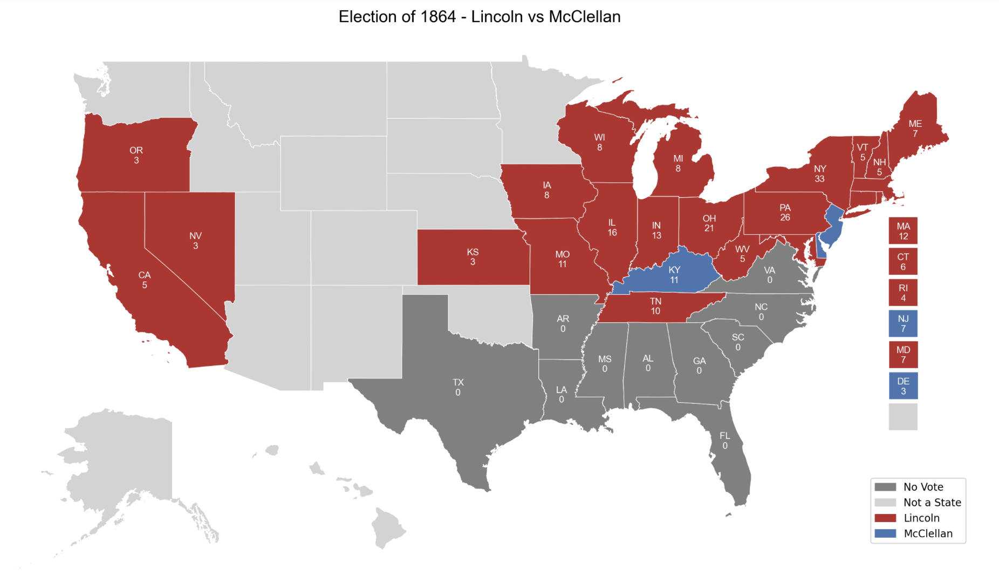

# Examples using PoliSciPy

Below is a gallery of images showing maps created using the PoliSciPy package.

---

**The Present: plotting current and future United States Elections**

One of PoliSciPy's strengths is its ability to plot current and future United States elections. PoliSciPy can be used to create state-of-the-art Electoral College visualizations that easily support an arbitrary number of candidates. Modern maps are perfect for creating hypothetical matchups or representing candidate performance. The vote bar at the top is especially useful for visualizing different win conditions based on the performance of specific candidates.

    
    
<em>Example: Figure with results from the 2024 U.S. election.</em>

---

**Early Post-Colonial History: plotting early United States elections**

After gaining independence, some of the United States' earliest elections featured maps that looked very different from those of today. These early elections included far fewer states, representing the original thirteen colonies, as well as some newly acquired territories, reflecting the fledgling nation. PoliSciPy allows users to visualize these territories and merged state regions (for example, Massachusetts once included what is now Maine, and Georgia encompassed present-day Mississippi and Alabama) by incorporating their data and colormaps.

    
    
<em>Example: Figure with Election of 1796.</em>

---

**Reconstruction: plotting more complex maps**

You can also plot more complex historical Electoral College maps that include states that did not participate in certain elections. After the Civil War, the tumultuous Reconstruction period meant that some Southern states did not cast any electoral votes. The consequences of this are illustrated below in the results of the 1864 Election.

    
    
<em>Example: Figure with Election of 1864.</em>

