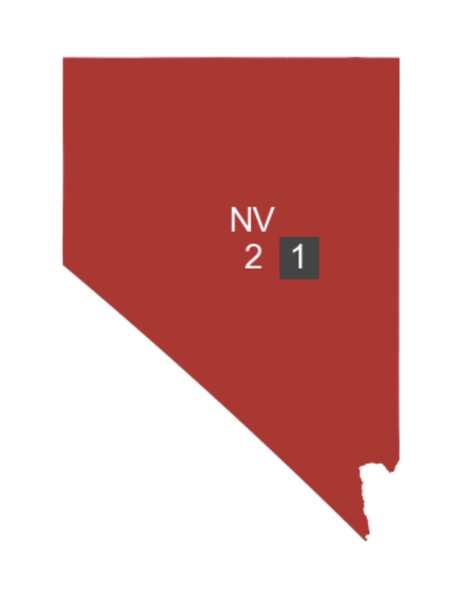
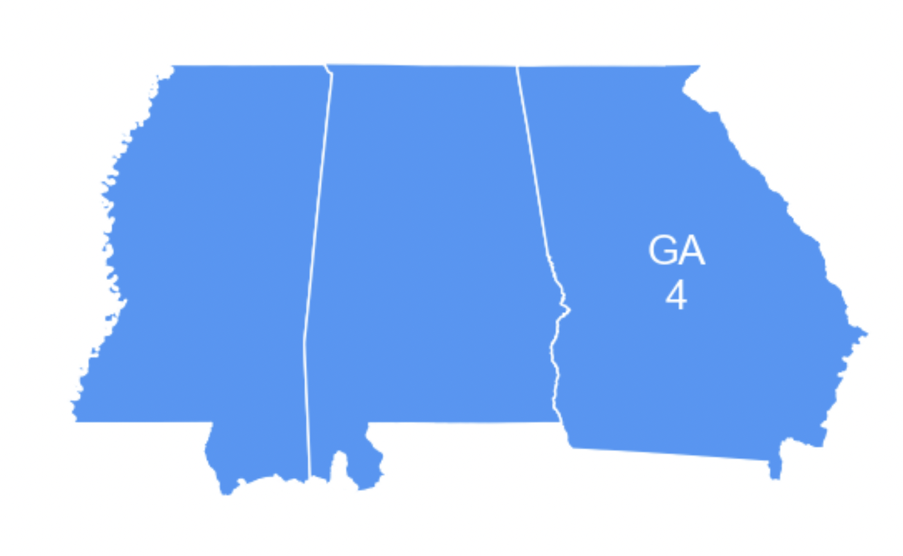

# Data

This section explains how to merge election data with shapefiles in PoliSciPy for creating visualizations of electoral college results. You will learn how to integrate election data into a geoDataFrame, handle non-winner-takes-all states like Nebraska and Maine, and account for defecting or faithless electors in your maps.

---

## Merging Election Data

Plotting electoral college data using PoliSciPy is very easy. All you need to do is create a dictionary with the data that you would like to plot, and then merge it into the geoDataFrame above.

### Adding the data

To merge the election results into your geoDataFrame, create or import a dictionary with the election data for each state, then map the results to the appropriate state abbreviations in the geoDataFrame.

```python
winning_party_2024 = {
    'AL': 'Republican', 'AK': 'Republican', 'AZ': 'Republican', 'AR': 'Republican', 'CA': 'Democrat',
    'CO': 'Democrat', 'CT': 'Democrat', 'DE': 'Democrat', 'FL': 'Republican', 'GA': 'Republican',
    'HI': 'Democrat', 'ID': 'Republican', 'IL': 'Democrat', 'IN': 'Republican', 'IA': 'Republican',
    'KS': 'Republican', 'KY': 'Republican', 'LA': 'Republican', 'ME': 'Democrat', 'MD': 'Democrat',
    'MA': 'Democrat', 'MI': 'Republican', 'MN': 'Democrat', 'MS': 'Republican', 'MO': 'Republican',
    'MT': 'Republican', 'NE': 'Republican', 'NV': 'Republican', 'NH': 'Democrat', 'NJ': 'Democrat',
    'NM': 'Democrat', 'NY': 'Democrat', 'NC': 'Republican', 'ND': 'Republican', 'OH': 'Republican',
    'OK': 'Republican', 'OR': 'Democrat', 'PA': 'Republican', 'RI': 'Democrat', 'SC': 'Republican',
    'SD': 'Republican', 'TN': 'Republican', 'TX': 'Republican', 'UT': 'Republican', 'VT': 'Democrat',
    'VA': 'Democrat', 'WA': 'Democrat', 'WV': 'Republican', 'WI': 'Republican', 'WY': 'Republican',
    'DC': 'Democrat'
}
```

Then merge the dictionary with the `geoDataFrame` like this:

```python
# add the winning party and fill any missing data with 'No Data'
gdf['winning_party'] = gdf['STUSPS'].map(winning_party_2024).fillna('No Data')
```

This should merge the data so that you can start plotting it.

{: .important }
> You can merge your election data dictionary with the GeoDataFrame on any column as long as they match. However, it is generally easiest to perform the merge on the `STUSPS` column.

---

## Adding defectors

The ability to account for defecting or faithless electors is a crucial feature for electoral college maps. 

### Non-winner-takes-all states (Nebraska and Maine)

While most states use a "winner-takes-all" system, Nebraska and Maine are exceptions. These states allocate electoral votes by congressional district, in addition to awarding two electors to the overall statewide winner. As a result, a state with five electoral votes, for example, can split its votes among multiple candidates, creating a "split" state.

<div align="center">
    
    <div style="text-align: center;"><em>Example: Nebraska and Maine with Congressional District Wins, 2024.</em></div>
</div>

If you would like to represent this "split" state for Nebraska and Maine, you can use the `defectors` and `defector_party` columns in the `geoDataFrame`. To do this, simply input the number of defectors for each state and their respective party affiliation.

```python
# add the number of electors that voted for the other candidate
gdf.loc[38, 'defectors'] = 1 # maine
gdf.loc[10, 'defectors'] = 1 # nebraska

# set the political party for each of the congressional district winners
gdf.loc[38, 'defector_party'] = 'Republican'
gdf.loc[10, 'defector_party'] = 'Democrat'
```

**Note:** The value to use to index into the defecting voters colum for a given state is the index for that respective state. To identify the correct index for each state in the `geoDataFrame` that you would like to edit, you can filter it by the `STUSPS` column using the following line: `gdf['STUSPS']`

This will return a list of state abbreviations you can use:

```python
0     MS
1     NC
2     OK
3     VA
...
```

For a full example of creating Electoral College maps with non-winner-takes-all states included in the map see [Example 1](https://eolesinski.github.io/poliscipy/example-1.html) in the Examples section.

### Faithless electors

Similar to representing electoral votes for the Congressional districts in Maine and Nebraska, defecting voters can also be used to represent **faithless electors**. Faithless electors are electoral college voters who, despite their state's popular vote, choose to vote for a different candidate. While uncommon, the most recent instance occurred in 2016, when seven electors cast votes contrary to their states’ selections.

The approach for handling faithless electors in PoliSciPy is the same as for Congressional districts. To represent a faithless elector, set the value in the `defectors` column and the respective `defector_party` for that state. If no party is selected, the elector will be assigned to the `Other` category by default.

**Note:** Defecting voters may vote for the opposing party or for a candidate not on the ballot. In such cases, leaving the `defector_party` value blank in the `GeoDataFrame` will group them into the `Other` category automatically. For a full example, see [Example 2](https://eolesinski.github.io/poliscipy/example-2.html) in the Examples section.

### Split states

Another scenario where plotting defecting voters can be useful is in **historical elections**. Many elections, particularly between 1700 and 1800, involved states splitting their electoral votes, resulting in multiple candidates winning portions of a state’s total electoral votes. Similar to how Nebraska and Maine operate today, representing these defecting votes can provide a clear way to visualize multiple candidates winning parts of a single state.

### Absent/missing electors

<div style="display: flex; align-items: center; gap: 20px;">
  <div style="flex: 3;">
    <p>The final scenario where plotting defecting voters can be useful is when an electoral college voter is unable to cast their vote. In such cases, the vote may not be counted, even if it was intended for the winning candidate. For example, in 1864, one of Nevada's three electoral voters was caught in a snowstorm and could not cast their vote. Since there was no established procedure for handling absent voters at the time, the state only cast two votes for President Lincoln. PoliSciPy represents this scenario in <a href="https://eolesinski.github.io/poliscipy/example-3.html">Example 3</a> of the Examples section. By default, absent electoral votes are shown inside a dark grey box (see image to the right for reference).</p>
  </div>
  <div style="flex: 1; text-align: center;">
    
    <div><em>Nevada snowbound elector, 1864.</em></div>
  </div>
</div>

{: .important }
Any defector that does not have a value provided in the `defector_party` column will automatically default to the `Other/Unspecified` category and be shown on the map in a dark grey box.

---

## Representing Territories

<div style="display: flex; align-items: center; gap: 20px;">
  <div style="flex: 1; text-align: center;">
    
    <div><em>United States Territories in 1796.</em></div>
  </div>
  <div style="flex: 2;">
    <p>Some elections include territories or regions that, while part of the United States at the time, did not cast electoral votes. Representing these territories on the map can provide historical accuracy and help visualize the broader political and geographic context of an election. For an in-depth example of how to represent territories in PoliSciPy, see <a href="https://eolesinski.github.io/poliscipy/example-2.html">Example 2: Plotting Early Post-Colonial Elections</a>.</p>
  </div>
</div>

---

## Handling Abstaining States

During the Reconstruction period, some Southern states were part of the United States but did not cast any electoral college votes. To represent these states on a map using PoliSciPy, you can create a separate category in the colormap. Even though these states have no electoral votes, including this category in the `winning_party` column when merging your data will still plot the color over the state without counting any votes in the final results. For more detail on plotting electoral college maps from the Reconstruction period, see [Example 3: Plotting Reconstruction Elections](https://eolesinski.github.io/poliscipy/example-3.html).

---

## Handling Merged States

<div style="display: flex; align-items: center; gap: 20px;">
  <div style="flex: 2;">
    <p>In some early U.S. elections, state boundaries were different from what we recognize today. For example, Massachusetts once included the territory that is now Maine, and Georgia at one time encompassed both present-day Alabama and Mississippi. When plotting historical electoral maps, it is important to account for these merged states to accurately represent electoral votes and political geography. PoliSciPy allows you to adjust the GeoDataFrame to reflect historical boundaries, ensuring that electoral data is mapped correctly to each state as it existed at the time.</p>
  </div>
  <div style="flex: 1; text-align: center;">
    
    <div><em>State of Georgia, 1796.</em></div>
  </div>
</div>

 For a full example of how to represent states encompassing multiple territories, see [Example 2: Plotting Early Post-Colonial Elections](https://eolesinski.github.io/poliscipy/example-2.html).