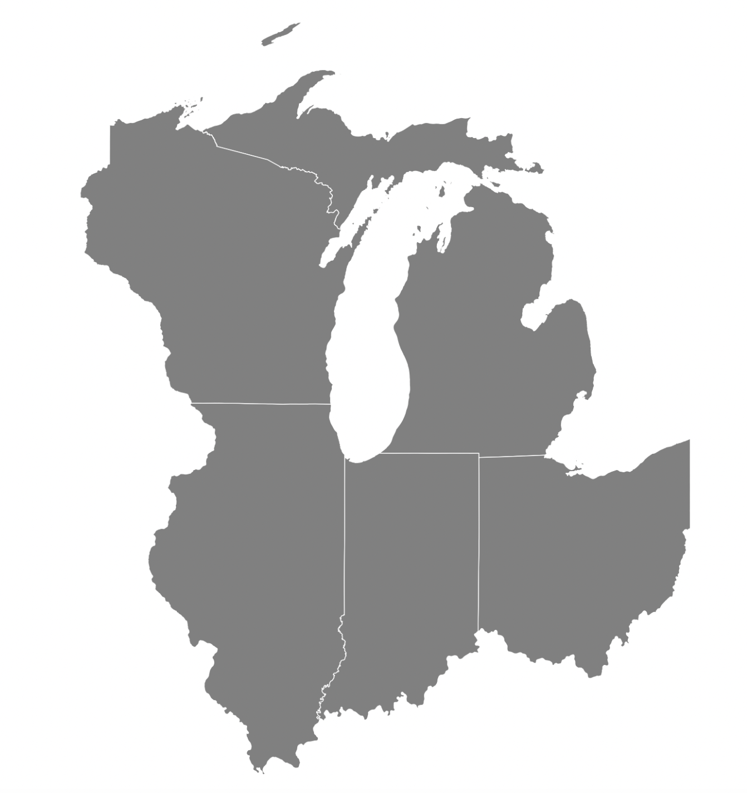

# Data

This section explains how to merge election data with shapefiles in PoliSciPy for creating visualizations of electoral college results. You will learn how to integrate election data into a geoDataFrame, handle non-winner-takes-all states like Nebraska and Maine, and account for defecting or faithless electors in your maps.

---

## Merging Election Data

Plotting electoral college data using PoliSciPy is very easy. All you need to do is create a dictionary with the data that you would like to plot, and then merge it into the geoDataFrame above.

### Adding the data

To merge the election results into your geoDataFrame, create or import a dictionary with the election data for each state, then map the results to the appropriate state abbreviations in the geoDataFrame.

```python
winning_party_2024 = {
    'AL': 'Republican', 'AK': 'Republican', 'AZ': 'Republican', 'AR': 'Republican', 'CA': 'Democrat',
    'CO': 'Democrat', 'CT': 'Democrat', 'DE': 'Democrat', 'FL': 'Republican', 'GA': 'Republican',
    'HI': 'Democrat', 'ID': 'Republican', 'IL': 'Democrat', 'IN': 'Republican', 'IA': 'Republican',
    'KS': 'Republican', 'KY': 'Republican', 'LA': 'Republican', 'ME': 'Democrat', 'MD': 'Democrat',
    'MA': 'Democrat', 'MI': 'Republican', 'MN': 'Democrat', 'MS': 'Republican', 'MO': 'Republican',
    'MT': 'Republican', 'NE': 'Republican', 'NV': 'Republican', 'NH': 'Democrat', 'NJ': 'Democrat',
    'NM': 'Democrat', 'NY': 'Democrat', 'NC': 'Republican', 'ND': 'Republican', 'OH': 'Republican',
    'OK': 'Republican', 'OR': 'Democrat', 'PA': 'Republican', 'RI': 'Democrat', 'SC': 'Republican',
    'SD': 'Republican', 'TN': 'Republican', 'TX': 'Republican', 'UT': 'Republican', 'VT': 'Democrat',
    'VA': 'Democrat', 'WA': 'Democrat', 'WV': 'Republican', 'WI': 'Republican', 'WY': 'Republican',
    'DC': 'Democrat'
}
```

Then merge the dictionary with the `geoDataFrame` like this:

```python
# add the winning party and fill any missing data with 'No Data'
gdf['winning_party'] = gdf['STUSPS'].map(winning_party_2024).fillna('No Data')
```

This should merge the data so that you can start plotting it.

{: .important }
> You can merge your election data dictionary with the GeoDataFrame on any column as long as they match. However, it is generally easiest to perform the merge on the `STUSPS` column.

---

## Adding defectors

The ability to account for defecting or faithless electors is a crucial feature for electoral college maps. 

### Non-winner-takes-all states (Nebraska and Maine)

While most states use a "winner-takes-all" system, there are two notable exceptions: Nebraska and Maine. These states allocate their electoral votes differently, apportioning them based on the percentage of votes each candidate receives in each congressional district, in addition to awarding two electors based on the winner of the overall state-wide popular vote. This system can result in cases where, despite having five electoral votes, multiple candidates may be awarded electoral votes in Nebraska, leading to a "split" state.

<div align="center">
    
    <div style="text-align: center;"><em>Example: Nebraska and Maine with Congressional District Wins, 2024.</em></div>
</div>

If you would like to represent this "split" state for Nebraska and Maine, you can use the `defectors` and `defector_party` columns in the `geoDataFrame`. To do this, simply input the number of defectors for each state and their respective party affiliation.

```python
# set the number of defectors for each state to one
gdf['defectors'][10] = 1 # nebraska
gdf['defectors'][38] = 1 # maine

# set the party affiliation of the defecting voter
gdf['defector_party'][10] = 'Democrat'
gdf['defector_party'][38] = 'Republican'
```

Note: To identify the correct index for each state in the `geoDataFrame`, you can filter it by the `STUSPS` column using the following line: `gdf['STUSPS']`

This will return a list of state abbreviations you can use:

```python
0     MS
1     NC
2     OK
3     VA
...
```

For a full example of creating Electoral College maps with non-winner-takes-all states included in the map see Example 1 in the Tutorials and Examples section.

### Faithless electors

Similar to representing electoral votes for the Congressional districts in Maine and Nebraska, it can also be useful to use defecting voters to represent faithless electors. Faithless electors are electoral college voters that, despite the popular vote of the respective states, choose to vote a different candidate than their state selected. While rare, these faithless electors may vote for the other candidate or a candidate that does not even appear on the ballot. While rare, the most recent example of this occurred in 2016 when there were 7 electors that cast votes against the will of their respective states.

While faithless electors are rare, it can be useful to be able to represent them in electoral college maps. The approach for handling faithless electors is the same as for handling Congressional districts above. To add a faithless electors to any state simply set the value in the `defecting_voter` column and the respective `defector_party` for the respective state. If you do not select a defecting party they will be placed into the `Other` category by default.

Note: While defecting voters may sometimes vote for the opposing party, they may also vote for candidates not listed in the current election. In this case it may be useful to group them into an `Other` party rather than assigning them their own color value in the colormap. To do this, simply leave the `defector_party` value blank in the `GeoDataFrame` blank, and it will be assigned to the `Other` category by default. You can see an example of how to plot electoral college maps with faithless electors by taking a look at Example 2 in the Examples section.

### Split states

Another case when it could be usefully to be able to plot defecting voters is when plotting historical elections. Many historical elections, especially those between 1700-1800 often involved cases where states frequently split electoral votes leading to cases where many candidates won a portion of the total number of electoral votes from that state. Similar to how Nebraska and Maine operate today, it can be useful to plot these defecting electoral votes as an alternative way to represent multiple candidates winning parts of a single state.

### Absent/missing electors

<div style="display: flex; align-items: center; gap: 20px;">
  <div style="flex: 3;">
    <p>The final case where it may be useful to plot defecting voters is when an electoral college voter is unable to cast their vote entirely. In these cases, their vote may not be counted even if they had intended to vote for the winning candidate in their state. One example of this occurred in 1864 when one of Nevada's three electoral voters got caught in a snowstorm and was unable to cast their vote. Since there was not yet an established procedure for handling absent voters, the state only cast two votes for President Lincoln. You can see how this scenario is represented using PoliSciPy by viewing Example 3 in the Tutorials and Examples section. By default, absent electoral votes are put inside a dark grey box (see image to right and note below for more detail).</p>
  </div>
  <div style="flex: 1; text-align: center;">
    
    <div><em>Nevada snowbound elector, 1864.</em></div>
  </div>
</div>

{: .important }
Any defector that does not have a value provided in the `defector_party` column will automatically default to the `Other/Unspecified` category and be shown on the map in a dark grey box.

---

## Representing Territories

<div style="display: flex; align-items: center; gap: 20px;">
  <div style="flex: 1; text-align: center;">
    
    <div><em>United States Territories in 1796.</em></div>
  </div>
  <div style="flex: 2;">
    <p>Some elections include territories or regions that, while part of the United States at the time, did not cast electoral votes. Representing these territories on the map can provide historical accuracy and help visualize the broader political or geographic context of an election. For an in-depth example of how to represent territories in PoliSciPy, see Example 2: Plotting Early Post-Colonial Elections. Some elections include territories or regions that, while part of the United States at the time, did not cast electoral votes.</p>
  </div>
</div>

---

## Handling Abstaining States

During the reconstruction period there were some Southern states that were part of the United States, but did not have any electoral college votes. These states are often shown with zero electoral college votes. To represent this on a map using PoliSciPy, you can create a separate category in the colormap to represent these states. Despite having no electoral votes, you can still include this additional category in the `winning_party` column when merging in the data. This will plot the color over the respective state without counting any of their votes in the final results. For more detail on how to plot electoral college maps from the Reconstruction period, see Example 3: Plotting Reconstruction Elections.

---

## Handling Merged States

<div style="display: flex; align-items: center; gap: 20px;">
  <div style="flex: 2;">
    <p>The final case where it may be useful to plot defecting voters is when an electoral college voter is unable to cast their vote entirely. In these cases, their vote may not be counted even if they had intended to vote for the winning candidate in their state. One example of this occurred in 1864 when one of Nevada's three electoral voters got caught in a snowstorm and was unable to cast their vote. Since there was not yet an established practice for handling absent voters, the state only.</p>
  </div>
  <div style="flex: 1; text-align: center;">
    
    <div><em>State of Georgia, 1796.</em></div>
  </div>
</div>

During some early elections, some states had boundaries that were different from those of today. As an example, Massachusetts encompassed what is today Maine and Georgia once included both Alabama and Mississippi. 