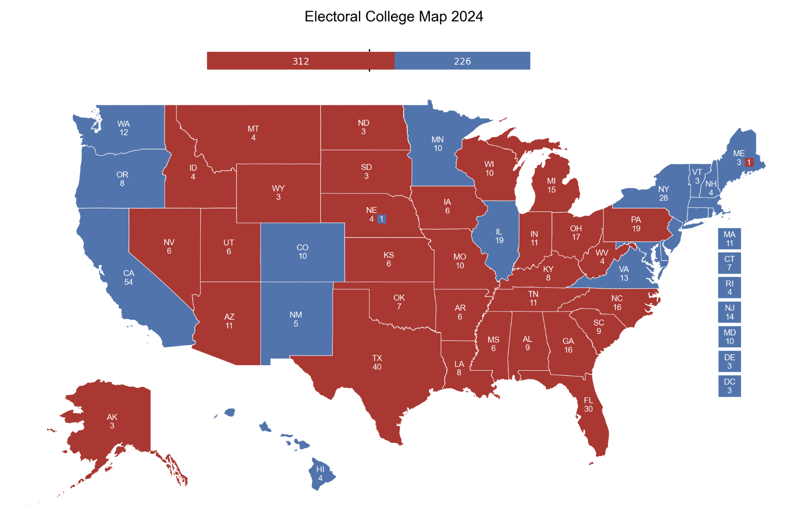

# Quickstart Guide

Welcome to the quickstart guide for PoliSciPy! This guide will help you quickly create your first U.S. electoral college map, including handling defecting voters, customizing the map, and optionally adding a vote summary bar.

---

## Step 1: Install PoliSciPy

You can install PoliSciPy via `pip` or `conda`, or install the latest version directly from GitHub. For most users, `pip` is recommended:

```
pip install poliscipy
```
Alternatively, with `conda`:
```
conda install -c conda-forge poliscipy
```
Or, if you want the most up-to-date version, you can clone the GitHub repository and install it directly:
```
git clone https://github.com/username/poliscipy.git
cd poliscipy
pip install .
```

For detailed installation instructions, see the [Installation page](https://poliscipy.github.io/poliscipy/installation.html).

---

## Step 2: Import PoliSciPy and Load Data

Once you have installed PoliSciPy, you can start by importing the package and loading the electoral college data. You can do this by running:

```
import poliscipy
```

First, import the necessary functions and load the U.S. state shapefile with electoral votes:
```python
from poliscipy.shapefile_utils import load_shapefile
from poliscipy.plot import plot_electoral_map

# Load U.S. electoral college geospatial data
gdf = load_shapefile()
```

**Note:** The default year for election data is 2024, but users can pass in a `year` parameter to `load_shapefile(year="2020")` to get a geoDataFrame with historical election data.

---

## Step 3: Prepare Data for Plotting

Next, you’ll want to load or define the data you want to visualize on the map. This could be voting results, party affiliations, or any other relevant data for each state.

For example, let's define the winning party for each state in the 2024 U.S. election:

```python
winning_party = {
    'AL': 'Republican', 'AK': 'Republican', 'AZ': 'Republican', 'AR': 'Republican',
    # Add all states here...
}

# Merge the winning party data with the GeoDataFrame
gdf['winning_party'] = gdf['STUSPS'].map(winning_party).fillna('No Data')
```

In this example, the `winning_party` dictionary maps state codes (like 'AL' for Alabama) to the party that won the election in that state.

For additional information on how to merge data with the GeoDataFrame please see the [data and shapefiles](https://poliscipy.github.io/poliscipy/data-and-shapefiles.html) section.

---

## Step 4: Handling Split States and Defectors

For states with non-winner-takes-all allocations (e.g., Maine and Nebraska), specify defecting voters:

```python
# Specify the number of defectors for each state
gdf.loc[38, 'defectors'] = 1 # Maine
gdf.loc[10, 'defectors'] = 1 # Nebraska

# Specify the party each defector voted for
gdf.loc[38, 'defector_party'] = 'Republican'
gdf.loc[10, 'defector_party'] = 'Democrat'
```
These values will be displayed as separate boxes on the map to indicate defecting electoral votes.

For more information on handling split states and defecting voters check out the [Adding Defectors](https://poliscipy.github.io/poliscipy/merging-data.html#adding-defectors) section on the Merging data page.

---

## Step 5: Plot the Electoral College Map

Now that the data is prepared, it’s time to plot the electoral college map. Use `plot_electoral_map()` to visualize the election results:

```python
plot_electoral_map(
    gdf, 
    column='winning_party', 
    year='2024', 
    title='2024 U.S. Electoral College Map'
)
```

This will generate a map that visualizes the election results by party affiliation for each state. The column parameter indicates the column to plot (in this case, `winning_party`), and the year and title parameters are optional, used to annotate the map with the relevant election year and title.

---

## Step 6: Customize the Map (Optional)

PoliSciPy allows for customization of the map’s appearance. You can adjust figure size, label colors, state borders, and other options:

```python
plot_electoral_map(
    gdf,
    column='winning_party',
    year='2024',
    title='2024 U.S. Electoral College Map',
    figsize=(10, 6),
    edgecolor='black',
    labelcolor='white'
)
```

This gives you full control over the map’s appearance.

---

## Step 7: Add a Vote Summary Bar (Optional)

PoliSciPy can display a horizontal vote bar summarizing total votes per party:

```python
plot_electoral_map(
    gdf,
    column='winning_party',
    year='2024',
    title='2024 U.S. Electoral College Map',
    vote_bar=True
)
```

- The vote bar accounts for defecting voters.
- Each party is colored according to `default_party_colors` or a custom color map.

---

## Example Output

Here’s an example of what the map should look like:

<div align="center">
    
    <div style="text-align: center;"><em>Example: Figure with results from the 2024 U.S. election.</em></div>
</div>

---

## Next Steps

Now that you’ve created your first electoral college map with PoliSciPy, you can:

- Explore different election years by passing year to `load_shapefile()`.
- Learn how to customize your maps further with advanced styling options.
- Refer to the [API documentation](https://poliscipy.github.io/poliscipy/api-reference.html)  for a complete list of all available functions and options.

